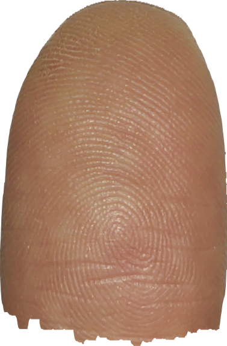
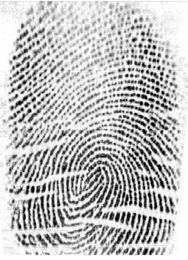
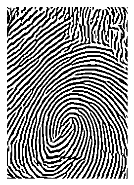

# contactless-fingerprint-recognition

## 1. Image Enhancement

### origin image

contactless fingerphoto

contact fingerprint

### enhancement image

contactless fingerphoto NFIQ score: **79**

contact fingerprint NFIQ score: **72**

## 2. Distortion Correction and Scaling

ref to [C2CL: Contact to Contactless Fingerprint Matching](https://ieeexplore.ieee.org/abstract/document/9646891)

train network [Spatial Transformer Networks](https://proceedings.neurips.cc/paper_files/paper/2015/hash/33ceb07bf4eeb3da587e268d663aba1a-Abstract.html) with thin-plate-spline (TPS) and [Learning a Fixed-Length Fingerprint Representation (DeepPrint)](https://ieeexplore.ieee.org/abstract/document/8937828) to learn both distortion correction and scaling correction simultaneously. 